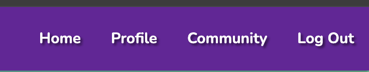

# FITHUB

## Introduction

I was tasked with having to devleop a full stack site which stores and manages data using either a relational or non-relational database. 
I chose to work with a non-relational database and therefore choses to use MongoDB to create, store and update my data.

For my Milestone Project 3 I have developed a backend web application using HTML, CSS, Javascript and Python with Flask. Each language I have used has contributed to my Fithub site.

I have created Fithub not only for the purpose of my project but to build a fitness commmunity where people can gather together and be inspired by one another through fitness. Fithub is a site where anyone who wants to get motivation from others can view, post and like different workouts. Fitness for me is a lifestyle and I would love to share my love for fitness with as many people as possible, hence Fithub. 

## Background Research
Before I set out on my project I had a look through gym websites to get inspiration and an understanding of layout.
- [The Gym](https://www.thegymgroup.com/)
- [Puregym](https://www.puregym.com/)
- [Anytime Fitness](https://www.anytimefitness.co.uk/)

I really liked the look of [Anytime Fitness](https://www.anytimefitness.co.uk/) because of the simplistic layout and colour blend.

## Features

This site has been designed to be very user friendly and intuitive through the easy navigation, theme and layout of the website.

- The first page that a user will encounter is the homepage. This page is more of a welcome page for new users.
- For users to be able to get the full functionality of Fithub they will need to register with a username, email-address, dob and password.
- Once users have logged in they will get redirected to their profile page. This page allows users to store, update and delete data.
- Users can visit the community page to view theirs and others posts and interact with them.

### Known Features

| Feature Title | Value | Screenshot |
| :---: | :---: | :---: | 
| Brand Logo | This gives us brand recognition but also is used to take users to the homepage. |  |
| Navigation Bar | This allows navigation for the Fithub site. |  |
| Footer | Contains social media links for the site. |  |
| Edit Post Button | This allows members to edit their posts. |  |
| Delete Post Button | This allows members to delete their posts. |  |
| View Profile Button | This allows members to view their own profile. |  |
| Make New Post Button | This allows members to make a new post on Fithub. |  |
| Edit Profile Button | This allows members to edit information about the profile. |  |
| Delete Profile Button | This allows members to delete their profile. |  |
| Cancel/Back Buttons | This allows users to back out of unwanted pages. |  |
| Search Bar | This allows members to query workout categories and workout descriptions |  |
| Post Cards | This holds the workout posts made by users and can be viewed on the profile and community page. |  |
| Submit Form Button Title | This button posts forms to the database. |  |
| Log In Form  | This form allows members to sign in again to view the site. |  |
| Register Form | This form is for new users to register and view the site. |  |
| Add Post Form | This form allows users to create new workout posts. |  |
| Edit Post Form | This form allows users to edit already posted workouts. |  |
| Flash Messages | This will flash up to notify users when they have submitted a form on the FitHub site. |  |
| Log Out | This function logs users out of the site. |  |

## Wireframes 
- All my wireframes were created on [Balsamiq](https://balsamiq.com/)
- Note: These wireframes were the general structure and basis of my project so during the project I updated certain aspects and removed aspects which I thought were unecessary.

Fithub Homepage

Fithub Profile Page

Fithub Community Page

Fithub Add Post Page

Fithub Edit Post Page

Fithub Login Page

Fithub Register Page

## User Stories

### New Users Goals

- As a new user, I would like to view a fitness site to get inspiration and knowledge from other people who may have more experience than me.
- As a new user, I would like to register and become a part of the community as easily as possible.
- As a new user, I would like to be able to view the workout from others and get insight through an explanation of the workout.
- As a new user, I would also like to post content for people to see how I would do and maybe give me advice on how to improve future workouts.
- As a new user, I would like to search for different types of workouts that people will be doing in order for me to tailor my workout.

### Returning Users Goals
- As a returning user, I would like to be able to log in easily and efficiently.
- As a returning user, I would like to be able to see my posts saved and stored somewhere I can access.
- As a returning user, I would like to be able to have the ability to change features of my account.
- As a returning user, I would like to be able to have the freedom of deleting my account whenever I please and not have my personal data lying around.

### Site Admin Goals
- As the site admin, I should be able to delete any posts that I believe are not appropiate to be displayed on Fithub
- As the site admin, I should be able to delete any users who are not using Fithub for its uses and purposes..

## Colour Scheme

The main colours I used were Orange and Blue. The reason for these colours were that they were a good blend whilst keeping my site profesional but still upbeat. I changed the shades of blue a couple of times but kept orange relatively consistent.

## Typogrphy 

I used two main fonts for this site:
- [Nunito](https://fonts.google.com/specimen/Nunito+Sans?query=nunito) 
I used this font for my main headers, titles and subtitles
- [ABeeZee](https://fonts.google.com/specimen/ABeeZee?query=ABeeZee)
I used this font for my paragraphs and smaller text.

## Tools, Technologies and languages

Below are the following which helped me create Fithub:

### Languages
- Python was used for backend development
- HTML was used for the main frontend aspect of the site.
- CSS was used for the frontend design and layout.
- Javascript was used for frontend interation on the site.
- JQuery was used for initializing Materialize features.

### Frameworks, Libraries and Programs
- [Flask](https://pypi.org/project/Flask/) was used as the Python framework for this site.
- [MongoDB](https://www.mongodb.com/) was used to store and manage my non-relational database.
- [Heroku](https://www.heroku.com) used as my deployment host.
- [Github](https://github.com/) used as repository for my code.
- [Git](https://git-scm.com/) was used for version control.
- [Materialize](https://materializecss.com) was used as a CSS framework to allow responsive and interation in my site.
- [Font Awesome](https://fontawesome.com/) was used for icons to help with user design.
- [Google Fonts](https://fonts.google.com/) was used to approopiate my site through different fonts.
- [Gitpod](https://www.gitpod.io/) code editor which helped me write the code for Fithub.
- [Jinja](https://jinja.palletsprojects.com/en/3.1.x/) - templating engine and code checker.

## Future Implementations

I have had great time making this project. Its opened my mind to many possibilities of how I can improve and better Fithub.

- I would like to create functionality for users to upload videos of their workouts and add them to thier posts to create more interactivity.
- I would like to create a reward system for individuals who have maybe hit 20 posts or 50 posts etc.
- I have required for users to provide their emails so maybe in the future be able to allow users to suscribe to a newsletter.
- I would've liked to have my add post page more descriptive and tailored to the workout for users. E.g. have fields for workout sets, workout weights and workout reps. This would help users to easily note workouts made by other users.
- I would like to create a favourites page for users. This would help users pick their favourite workouts and keep them on a page that they can access easily instead of scrolling through the communities page to re find workouts that they liked.
- I would like to create a comments section to increase online interation with users.

## Deployment & Local Development

### MongoDB

This project uses [MongoDB]() for the Non-Relational Datanse.

The get your own MongoDB Database URI, sign-up. on their site and follow these steps:

- Pick a name for your database. I for example called it "**Fithub**".
- You then need to create a collection(s) for the database. I for example used "**Users**" , "**Workouts**" and "**Posts**".
- Click on the Cluster nane for your project.
- Click on the **Connect** button.
- Click **Connect Your Application**
- Copy the connection string, and replace the `password` in the string with your own MongoDB password. Make sure to remove the angle brackets either side of your password.

## Heroku Deployment

My project uses [Heroku](), a platform as a service (PaaS)  that enables developers to build, run and operate applications entirely in the cloud.

Here are the deployment steps:

- Select **New** in the top right corner of your Heroku Dashboard, and select **Create New App** from the dropdown menu.
- Your app must be unique, and then choose a region closest to you (EU or USA), finally, select **Create App*.
- From the new app **Settings**, click the **Reveal Config Vars**, and set your enviroment variables.

| Key | Value |
| --- | --- |
| `IP` | 0.0.0.0 |
| `PORT` | 5000 |
| `SECRET_KEY` | user's own value |
| `DATABASE_URL` | user's own value |
| `MONGO_DBNAME` | user's own value |
| `MONGO_URI` | user's own value |

Heroku now needs two files to allow the user to deploy their project:

- requirements.txt
- Procfile

You can install this project's **requirements** (where applicable) using:
- `pip3 install -r requirements.txt`

If you have your own packages that have been installed, then the requirements file needs to be updated using:
- `pip3 freexe --local > requirements.txt`

The Procfile can be created with the follwoing command:
- `echo web: python app.py > Procfile` (make sure you use a capital P and also make sure that you use the name of your actual Flask app name, the one at the root-level.)

For Heroku deployment, follow these steps to connect your own GitHub repository to the nearly created app:

Either:
- Select **Automatic Deployment** from the Heroku app.

Or:

- In the Terminal/CLI, connect to Heroku using this command `heroku login -i`
- Set the remote for Heroku: `heroku git:remote -a app_name` (replace **app_name** with your app name)
- After performing the standard Git `add`, `commit`, and `push` to Github, you can now type:
- `git push heroku main`

The project is now connected and deployed to Heroku.

### Local Deployment

This project can be cloned or forked in order to make a local copy on your own system.
For either method, you will need to install any applicable packages found within the **requirements.txt** file.

- `pip3 install -r requirements.txt`

### Cloning

You can clone the Recipe Base repository by following these steps:

1. Go to the [GitHub repository](https://github.com/boderg/recipe-base)
2. Locate the Code button above the list of files and click it
3. Select if you prefer to clone using HTTPS, SSH, or GitHub CLI and click the copy button to copy the URL to your clipboard
4. Open Git shell or Terminal
5. Change the current working directory to the one where you want the cloned directory
6. In your IDE Terminal, type the following command to clone my repository:  
  `git clone https://github.com/JeyAsare/fithub`
7. Press Enter to create your local clone.

### Forking

By forking the GitHub Repository, we make a copy of the original repository on our GitHub account to view and/or make changes without affecting the original owner's repository.
You can fork this repository by using the following steps:

1. Log in to GitHub and locate the [GitHub Repository](https://github.com/JeyAsare/fithub)
2. At the top of the Repository (not top of page) just above the "Settings" Button on the menu, locate the "Fork" Button.
3. Once clicked, you should now have a copy of the original repository in your own GitHub account!

## Credits 

## Media 

- I got all my images from [Midjourney](https://www.midjourney.com/home)

### Acknowledgements

- I would like to thank Code Institute for giving me the platform to be able to create such sites and applications.
- I would like to thank my family for their encouragement through this Milestone Project 3. 
I used Youtube quite a bit to assist me with my project and I came across [Corey Schafer](https://www.youtube.com/@coreyms) who had videos on Python Flask which helped me.