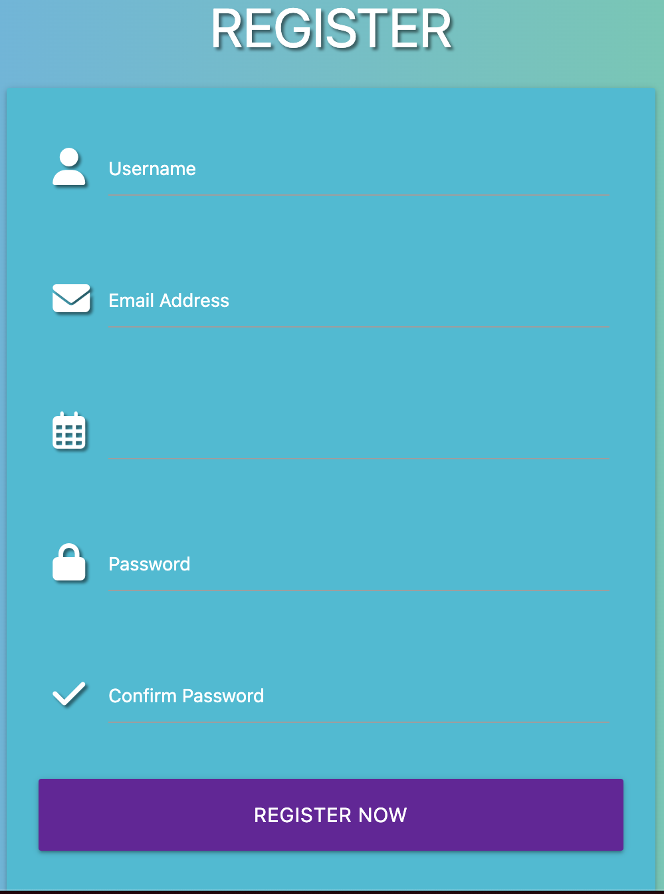
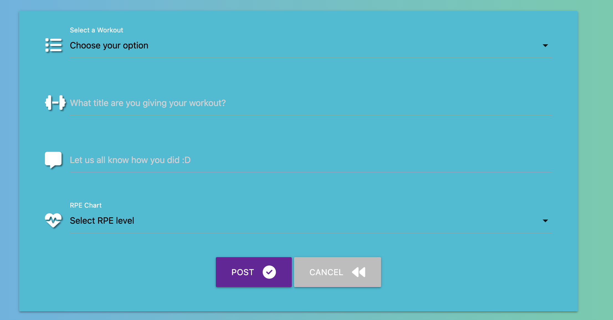

# FITHUB Testing Page

## Validation 

### HTML Validation

I used [W3C HTML Validator](https://validator.w3.org/) to validate my html pages. I used the URL input from my deployed site on heroku to validate my code so any errors for my jinja templating were uncovered.

Home HTML

Profile HTML

Community HTML

Workout Categories HTML

Edit Profile HTML

Add Post HTML

Login HTML

Register HTML

### CSS Validation

I used [W3C CSS Validator](https://jigsaw.w3.org/css-validator/) to validate my CSS.

CSS Validation

### JS Validation

I used [JShint](https://jshint.com/) to validate my Javascript code. My code came back with some unused variables however it weas variables that I copied and pasted off materialize.

JSHint

### Python Validation

I used [CI Python Linter](https://pep8ci.herokuapp.com/) to validate my Python code.

Python Linter

## Lighthouse

I used Lighthouse from my dev tools to analyse the efficiency of my site from desktop to mobile view. What I have seen from the results is that my mobile view's performance and accessibility is lower than my desktop view.

Home View

Log In View

Register View

Workout Categories View

Community View

Add Post View

Edit Post View

Edit Profile View

## User Story Tests
| User Story | Action | Screenshot |
| --- | --- | --- |
| As a new user, I would like to register and become a part of the community as easily as possible. | Registration Page |  |
| As a new user, I would like to be able to view the workout from others and get insight through an explanation of the workout. | Community Page |  |
| As a new user, I would also like to post content for people to see how I would do and maybe give me advice on how to improve future workouts. | Add Post Page |  |
| As a new user, I would like to search for different types of workouts that people will be doing in order for me to tailor my workout. | Search Bar |  |
| As a returning user, I would like to be able to log in easily and efficiently. | Log In Page |  |
| As a returning user, I would like to be able to see my posts saved and stored somewhere I can access. | Profile Page |  |
| As a returning user, I would like to be able to have the ability to change features of my account. | Edit Post Page |  |
| As a returning user, I would like to be able to have the freedom of deleting my account whenever I please and not have my personal data lying around. | Delete Profile Modal |  |
| As a returning user, I would like to be able to have the freedom of deleting my own posts whenever I please. | Delete Post Modal |  |

## Manual Testing 

To make sure there were no faults or issues with my site I took the time to test all the features of my sight to make sure they were functioning correctly.

Home Page  (New User)

| Feature | Expected Outcome | Action | Result | Pass/Fail |
| --- | --- | --- | --- | --- |
| Brand Logo | Brand Logo is expected to become a link to the homepage for users. | Click on Brand Logo | Take user to homepage | Pass |
| Log In (Top Navbar) | Log In Nav link is supposed to take me to the log in page  | Click Log In Nav link | Take user to login page | Pass |
| Register (Top Navbar) | Register Nav link is supposed to take me to the register page  | Click on Register Nav link | Take user to register page | Pass |
| Footer links (social media links) | Footer links are supposed to take me to social media site I clicked on | Click on footer links | Take user to social media site that they clicked on | Pass/ |
| "SIGN UP HERE" anchor link | This link should only be for first time users to take them to the register page. Once the user signs up or is logged in the anchor link and text should not be seen. | Click on the anchor link and sign up and once signed up go back to the homepage. | Take the user to register page. Once signed up and taken back to the homepage. Link should not be visible anymore | Pass |

Profile Page

| Feature | Expected Outcome | Action | Result | Pass/Fail |
| --- | --- | --- | --- | --- |
| Profile Page  | Once I am signed up or logged in, the site should take me straight to my profile page where I can see my username and other buttons. | Signed up or logged in should take me to my profile page. | View my profile page | Pass |
| Extra Nav Links  | Once I am signed up/in, I now have access to the full site where I can see more nav links | Signed up or Logged In | User should be able to see added Community, Workout Categories and Profile Nav links. | Pass |
| View Profile Button | When I click on the view profile button I should be able to view profile details which I signed up with | Click on View Profile Button | Details of profile should appear | Pass |
| Make A Post Button | When I click on the Make A Post button, site should direct me to the add post form. | Click on Make A Post Button | User should be taken to add post form | Pass |

Community Page

| Feature | Expected Outcome | Action | Result | Pass/Fail |
| --- | --- | --- | --- | --- |
| Search Button | When I type into this bar keywords pertaining to the workout category or description I should have available posts according to what I have typed and searched for | Type in different words | Posts which contain words which I have typed appear on my screen | Pass |
| Reset Button | When I click on the reset button the button should restore my page from select categories in which I have typed back to the normal rendering community page with all workouts that have been posted | Click Reset Button | All workouts appear on the screen | Pass |
| Card Reveal | The Elipsis on workout cards should reveal the workout description and the date posted. | Click on the Elipsis | Card should reveal workout desctiption and date posted. | Pass |

Add Post Page

| Feature | Expected Outcome | Action | Result | Pass/Fail |
| --- | --- | --- | --- | --- |
| Dropdown | The Dropdown feature is expected to allow users to pick different preferred options. | Click on the dropdown | Expanded view of different options to select | Pass |
| Post Button | When I click on the post button, all the information in my form should be send off to the database. | Click the post button. | Form should successfully send off to the database | Pass |
| Cancel Button | When I click on the cancel button, I should be redirected back to my profile page. | Click on the cancel button | Taken back to my profile page | Pass |
| Required feature | This feature means that users will not be allowed to post their workouts if they do not fill out all required fields. | Do not fill out a field. | Message appears to fill in field. | Pass |

Edit Post Page

- This section is identical to the Add Post Page bar some extra features.

| Feature | Expected Outcome | Action | Result | Pass/Fail |
| --- | --- | --- | --- | --- |
| Fields already filled in | When I click on Edit post page all my previous information should be already stored on the form. | Click on the edit button | Due to jinja templating information that users have already put in should be saved onto the edit post form | Pass |
| Edit Post Button | When I click on the edit post button my newly edited data should be posted and sent to the databases to be stored | Click on the edit post button | Once the user clicks on the edit post button all edited information should be sent up to the database. | Pass |

Edit Profile Page

| Feature | Expected Outcome | Action | Result | Pass/Fail |
| --- | --- | --- | --- | --- |
| Edit Profile Button | When I click on the edit profile button my newly edited data should be posted and sent to the databases to be stored | Click on the edit profile button | Once the user clicks on the edit profile button all edited information should be sent up to the database. | Pass |
| Back Button | When I click on the back button, I should be redirected back to my profile page. | Click on the back button | Taken back to my profile page | Pass |
| Delete Profile Button | Once I click on the delete profile button site should show me a modal. | Click on delete profile button | Modal asking me if I am sure to delete my profile shows up. | Pass |
| Fields already filled in | When I click on Edit profile page all my previous information should be already stored on the form. | Click on the edit profile button | Due to jinja templating information that users have already put in should be saved onto the edit profile form | Pass |

Workout Categories Page

| Feature | Expected Outcome | Action | Result | Pass/Fail |
| --- | --- | --- | --- | --- |
| Post Workout Button | When I click on this button I should be taken to the add post page. | Click on the Post Workout Button | Directed to add post page | Pass |

Log In Page

| Feature | Expected Outcome | Action | Result | Pass/Fail |
| --- | --- | --- | --- | --- |
| Log In Button | When I click on the log in button I expect to be logged into a session. | Click on the log in button. | Once I click on the log in button I should be logged into a session. | Pass |
| Create new account Link | When I click on the create new account anchor link I should be taken to the register page. | Click on the create account anchor link | Once I click on the create new account I should be taken to the register page | Pass |

Register Page

| Feature | Expected Outcome | Action | Result | Pass/Fail |
| --- | --- | --- | --- | --- |
| Register Now Button | When I click on the Register now button I expect to be registered. | Click on the Register now button. | Once I click on the Register now button I should be registered on the site. | Pass |
| Log In Here Link | When I click on the Log In Here  link I should be taken to the register page. | Click on the Log In Here link | Once I click on the Log In Here link I should be taken to the log in page | Pass |

## Device Testing

- This site was tested on the following devices:

- Desktop
* MAC

- Laptop
* Macbook Pro

- Iphone
* Iphone 14 Pro Max

The following browsers I have used to test the site:

* Google Chrome
* Safari
* Microsoft Edge

Other device testing has been done by friends.